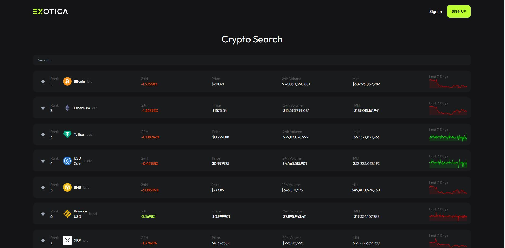
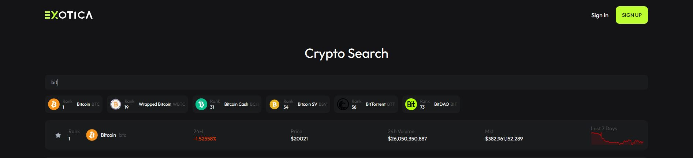
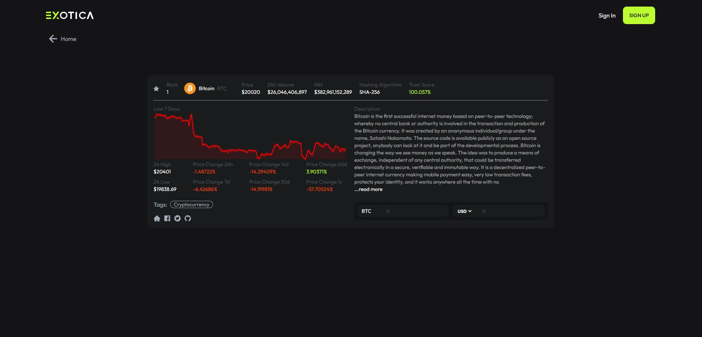
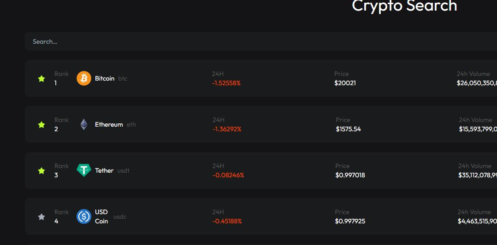
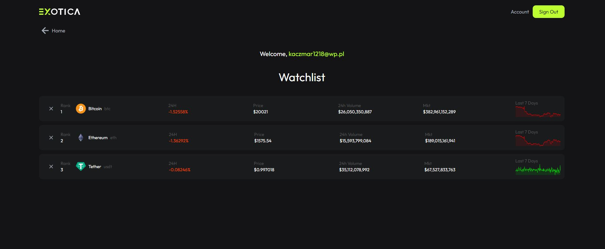
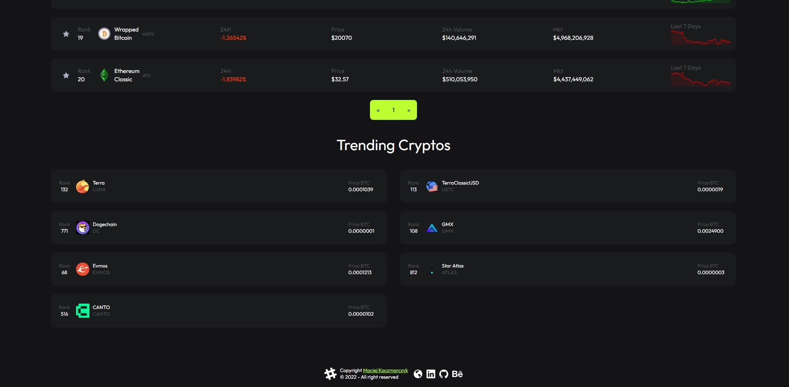

# EXotica - Crypto
> API-based website showing cryptocurrency exchange rates, charts and market capitalisation of cryptocurrencies.
> Live demo [https://exotica-crypto.web.app/](https://exotica-crypto.web.app/).

## Table of Contents
* [General Info](#general-information)
* [Technologies Used](#technologies-used)
* [Features](#features)
* [Screenshots](#screenshots)
* [Contact](#contact)

## General Information
The main focus of the project was to create a fully responsive application for checking up-to-date information on cryptocurrencies based on the Coingeko.com API. Personally, my main goal was to learn the basics of Reactjs and Tailwindcss. On which the whole project is based.

## Technologies Used
- "@testing-library/jest-dom": "^5.16.5",
- "@testing-library/react": "^13.3.0",
- "@testing-library/user-event": "^13.5.0",
- "axios": "^0.27.2",
- "body-scroll-lock": "^4.0.0-beta.0",
- "daisyui": "^2.22.0",
- "dompurify": "^2.3.10",
- "firebase": "^9.9.3",
- "html-react-parser": "^3.0.1",
- "react": "^18.2.0",
- "react-dom": "^18.2.0",
- "react-icons": "^4.4.0",
- "react-router-dom": "^6.3.0",
- "react-scripts": "5.0.1",
- "react-sparklines": "^1.7.0",
- "web-vitals": "^2.1.4"
- "autoprefixer": "^10.4.8",
- "postcss": "^8.4.16",
- "prettier": "2.7.1",
- "tailwindcss": "^3.1.8"

## Features
List the ready features here:
- Ranking of cryptocurrencies generated from the API
- Working pagination
- Cryptocurrency search bar 
- “Trending Cryptos” section, based on information from API
- Every Coin has its own page with more specific market information, description, tags, social media links and price converter for USD, EURO, PLN and GBP
- Possibility to create an account and save your favourite coins to the watchlist
- Every account is connected with the firebase backend and the watchlist is stored in the database

## Screenshots

### Coins List

### Search bar

### Coin Page

### Add to watchlist

### Whatchlist

### Trending Cryptos

## Contact
Created by [Maciej Kaczmarczykl](https://www.linkedin.com/in/maciejkaczmarczyk01/) - feel free to contact me!
